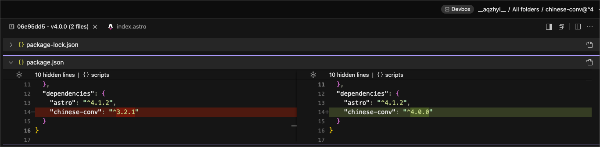

<p align="center">
  
</p>
<p align="center"><h1 align="center">CHINESE-CONV</h1></p>
<p align="center">
  <em><code>$ <b>pnpm add chinese-conv</b> 無依賴的 簡繁轉換工具</code></em>
</p>
<p align="center">
  
  
  
  
</p>

> [!NOTE]
>
> 我就懶，無依賴的，簡繁轉換解決方案。
>
> Zero dependencies, converting simplified to traditional and traditional to simplified

---

> [!IMPORTANT]
>
> 單純地一對一字符，字典互換，並且字典年代久遠窩都沒有更新
>
> 但這包窩私人偶爾會使用，我需求不多，堪用了
>
> 如果你需要 「異體字轉換、地區習慣用詞轉換」 請參考 [opencc](https://www.npmjs.com/package/opencc)

> [!IMPORTANT]
>
> just a simple one-to-one character swap, and the dictionary hasn't been updated for a long time
>
> but this private space is used occasionally, I don't need much, it's enough
>
> if you need "variant character conversion and regional term conversion," please refer to [opencc](https://www.npmjs.com/package/opencc)

---

# Demo

- [codesandbox.io / chinese-conv@^3](https://codesandbox.io/p/devbox/chinese-conv-tyrsvs?file=%2Fsrc%2Fpages%2Findex.astro)

- [codesandbox.io / chinese-conv@^4](https://codesandbox.io/p/devbox/chinese-conv-3-forked-63rzkw?file=%2Fsrc%2Fpages%2Findex.astro)

  <details>
  <summary>what Demo changes from v3 to v4</summary>
    
  </details>

# Install

```sh
# pnpm
pnpm add chinese-conv

# or..
deno add npm:chinese-conv
bun add chinese-conv
yarn add chinese-conv
npm add chinese-conv
```

# Usage

```ts
// ESM
import { tify, sify, tifyJson } from 'chinese-conv'

// or...
import { tify, sify, tifyJson } from 'chinese-conv/dist'
```

# Methods

## tifyJson 繁體化整個 js#Array 或 js#Object

```ts
import { tifyJson } from 'chinese-conv'

const chsAsObject = {
  text1: '所谓知己知彼百战不殆',
  text2: '作为星际2职业选手',
  text3: '他们在平时练习中不仅要练好自己的本族',
  text4: '还会经常选择其他两个族进行练习',
}
const chtAsObject = {
  text1: '所謂知己知彼百戰不殆',
  text2: '作為星際2職業選手',
  text3: '他們在平時練習中不僅要練好自己的本族',
  text4: '還會經常選擇其他兩個族進行練習',
}

expect(tifyJson(chsAsObject)).toEqual(chtAsObject)
```

## tify 繁體化字串

```ts
import { tify, sify } from 'chinese-conv'

// 正體中文化
const text = tify(
  '所谓知己知彼百战不殆，作为星际2职业选手，他们在平时练习中不仅要练好自己的本族，还会经常选择其他两个族进行练习，这样可以更加了解本族之外两个种族的运营流程、弱点、真空期等。因此不只有Flash，全世界许多职业选手都会在练习时偶尔使用下别的种族，这也是他们众多练习手段的一种。',
)
```

## sify 簡體化字串

```ts
import { tify, sify } from 'chinese-conv'

// 簡體中文化
const text = sify(
  '所謂知己知彼百戰不殆，作為星際2職業選手，他們在平時練習中不僅要練好自己的本族，還會經常選擇其他兩個族進行練習，這樣可以更加了解本族之外兩個種族的運營流程、弱點、真空期等。因此不只有Flash，全世界許多職業選手都會在練習時偶爾使用下別的種族，這也是他們眾多練習手段的一種。',
)
```

## 字典來源

<https://github.com/tongwentang/tongwen-dict>
