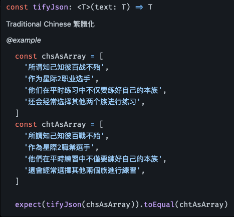
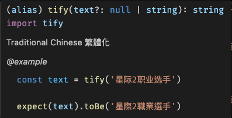
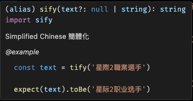

# About This

Simplified to traditional, or traditional to simplified.

簡轉繁，或繁轉簡。

# Install

`bun add chinese-conv -S`

or

`pnpm add chinese-conv -S`

, etc..

# Methods

## tifyJson 繁體化整個 js#Array 或 js#Object



```ts
import { tifyJson } from 'chinese-conv'

const chsAsObject = {
  text1: '所谓知己知彼百战不殆',
  text2: '作为星际2职业选手',
  text3: '他们在平时练习中不仅要练好自己的本族',
  text4: '还会经常选择其他两个族进行练习',
}
const chtAsObject = {
  text1: '所謂知己知彼百戰不殆',
  text2: '作為星際2職業選手',
  text3: '他們在平時練習中不僅要練好自己的本族',
  text4: '還會經常選擇其他兩個族進行練習',
}

expect(tifyJson(chsAsObject)).toEqual(chtAsObject)
```

## tify 繁體化字串



```ts
import { tify, sify } from 'chinese-conv'

// 正體中文化
const text = tify(
  '所谓知己知彼百战不殆，作为星际2职业选手，他们在平时练习中不仅要练好自己的本族，还会经常选择其他两个族进行练习，这样可以更加了解本族之外两个种族的运营流程、弱点、真空期等。因此不只有Flash，全世界许多职业选手都会在练习时偶尔使用下别的种族，这也是他们众多练习手段的一种。',
)
```

## sify 簡體化字串



```ts
import { tify, sify } from 'chinese-conv'

// 簡體中文化
const text = sify(
  '所謂知己知彼百戰不殆，作為星際2職業選手，他們在平時練習中不僅要練好自己的本族，還會經常選擇其他兩個族進行練習，這樣可以更加了解本族之外兩個種族的運營流程、弱點、真空期等。因此不只有Flash，全世界許多職業選手都會在練習時偶爾使用下別的種族，這也是他們眾多練習手段的一種。',
)
```
